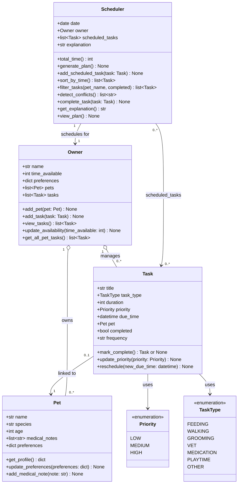

# PawPal+ — Final UML Class Diagram

Render this Mermaid code at [mermaid.live](https://mermaid.live) and export as PNG to produce `uml_final.png`.

```mermaid
classDiagram
    class Priority {
        <<enumeration>>
        LOW
        MEDIUM
        HIGH
    }

    class TaskType {
        <<enumeration>>
        FEEDING
        WALKING
        GROOMING
        VET
        MEDICATION
        PLAYTIME
        OTHER
    }

    class Pet {
        +str name
        +str species
        +int age
        +list~str~ medical_notes
        +dict preferences
        +get_profile() dict
        +update_preferences(preferences: dict) None
        +add_medical_note(note: str) None
    }

    class Task {
        +str title
        +TaskType task_type
        +int duration
        +Priority priority
        +datetime due_time
        +Pet pet
        +bool completed
        +str frequency
        +mark_complete() Task or None
        +update_priority(priority: Priority) None
        +reschedule(new_due_time: datetime) None
    }

    class Owner {
        +str name
        +int time_available
        +dict preferences
        +list~Pet~ pets
        +list~Task~ tasks
        +add_pet(pet: Pet) None
        +add_task(task: Task) None
        +view_tasks() list~Task~
        +update_availability(time_available: int) None
        +get_all_pet_tasks() list~Task~
    }

    class Scheduler {
        +date date
        +Owner owner
        +list~Task~ scheduled_tasks
        +str explanation
        +total_time() int
        +generate_plan() None
        +add_scheduled_task(task: Task) None
        +sort_by_time() list~Task~
        +filter_tasks(pet_name, completed) list~Task~
        +detect_conflicts() list~str~
        +complete_task(task: Task) None
        +get_explanation() str
        +view_plan() None
    }

    Task --> Priority : uses
    Task --> TaskType : uses
    Task "0..1" --> "1" Pet : linked to
    Owner "1" o-- "0..*" Pet : owns
    Owner "1" o-- "0..*" Task : manages
    Scheduler "1" --> "1" Owner : schedules for
    Scheduler "0..*" --> "0..*" Task : scheduled_tasks
```
